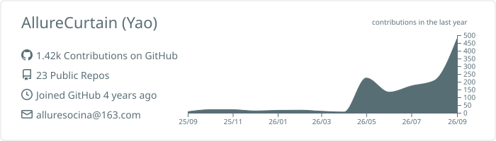
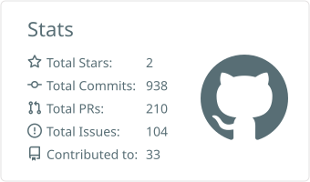
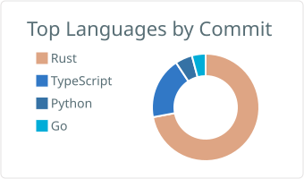

<h1 align="center">Yao</h1>

  <strong>Local-first developer tools in Rust · Git infrastructure contributor</strong>

  
  
  
  
  

---

## Open source contributions

**[gitmono-dev/mega](https://github.com/gitmono-dev/mega)** · monorepo platform for Git · **44 merged PRs**

Worked across the backend over roughly seven months. Main threads:

- **Code blame engine** — implemented the blame API, then refactored it onto block aggregation; fixed refs resolution and path-handling bugs
- **CL merge queue** — built the queue system, later reworked its architecture and position handling
- **Reviewer assignment** — Cedar policy-based assignment, including the secure-path implementation
- **Build triggers** — storage layer, trigger service, and task ID propagation into the build runner
- **Group permissions** — storage models, group/resource service, and the update-group API

**[libra-tools/git-internal](https://github.com/libra-tools/git-internal)** · **3 merged PRs**

Git note object parsing and generation, plus abstracting the HTTP and SSH protocol layers out of mega into a reusable crate.

## Projects

| Project | What it is | Stack |
|---|---|---|
| **[rove](https://github.com/AllureCurtain/rove)** | A local-first coding agent you can inspect, interrupt, resume, and trust. One durable runtime behind Desktop, Web, CLI, and API. | Rust · Tauri · Next.js |
| **[klip](https://github.com/AllureCurtain/klip)** | Windows clipboard manager — text, images, and files with full-text search, offline OCR, and privacy controls. | Rust · Tauri |
| **[aipop](https://github.com/AllureCurtain/aipop)** | Chrome MV3 extension for selection-based AI: translate, explain, and stream page summaries. Least-privilege, injected on demand. | TypeScript |
| **[narro](https://github.com/AllureCurtain/narro)** | Tech news reader organised into category leaderboards, with read tracking, noise filtering, and AI daily briefings. | TypeScript |

## Stats

  <picture>
    <source media="(prefers-color-scheme: dark)" srcset="./profile-summary-card-output/github_dark/0-profile-details.svg">
    
  </picture>

  <picture>
    <source media="(prefers-color-scheme: dark)" srcset="./profile-summary-card-output/github_dark/3-stats.svg">
    
  </picture>
  <picture>
    <source media="(prefers-color-scheme: dark)" srcset="./profile-summary-card-output/github_dark/2-most-commit-language.svg">
    
  </picture>

  
    Cards generated daily by
    <a href="https://github.com/vn7n24fzkq/github-profile-summary-cards">github-profile-summary-cards</a>
    and committed to this repository, so they render without depending on a third-party service.
  

