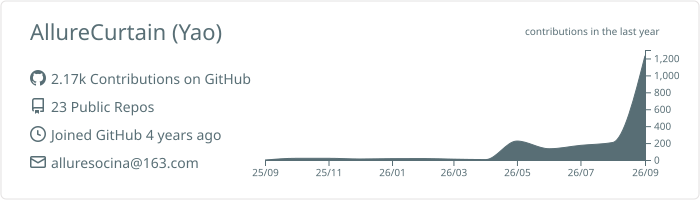
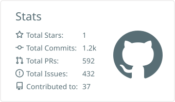
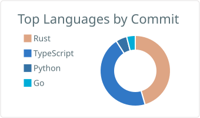
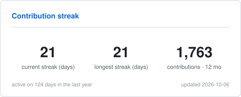

<h1 align="center">Yao</h1>

  <strong>Local-first developer tools in Rust · Git infrastructure contributor</strong>

<!-- BEGIN:AUTO:BADGES -->

  
  
  
  
  

<!-- END:AUTO:BADGES -->

---

## Open source contributions

**[sandbaseai/sandbase-harness](https://github.com/sandbaseai/sandbase-harness)** · local-first, self-hosted AI agent runtime · **<!--pr:sandbaseai/sandbase-harness-->385<!--/pr--> merged PRs**

Worked across the sandbox and session layers since mid-September 2026. Main threads:

- **Sandbox work leases** — claim, renewal, and reclaim semantics for sandboxed work; recovery of expired leases, and stopping queued work when a sandbox is released
- **Session lifecycle** — carrying a session's stop into work that arrives later, and keeping a claim scoped to one session and one environment
- **Session resources** — materializing file and repository resources for a session, and resolving the canonical in-sandbox roots on the local backend
- **Credentials** — keyed credential envelopes, excluded positions, and the boundary that keeps another server's credential undecryptable
- **Webhooks** — verifying the delivered signature off the wire, and a configurable auto-disable window
- **API conformance** — pinning wire codes, beta-header resource-family contracts, and pagination rules in tests

**[gitmono-dev/mega](https://github.com/gitmono-dev/mega)** · monorepo platform for Git · **<!--pr:gitmono-dev/mega-->44<!--/pr--> merged PRs**

Worked across the backend over roughly seven months. Main threads:

- **Code blame engine** — implemented the blame API, then refactored it onto block aggregation; fixed refs resolution and path-handling bugs
- **CL merge queue** — built the queue system, later reworked its architecture and position handling
- **Reviewer assignment** — Cedar policy-based assignment, including the secure-path implementation
- **Build triggers** — storage layer, trigger service, and task ID propagation into the build runner
- **Group permissions** — storage models, group/resource service, and the update-group API

**[libra-tools/git-internal](https://github.com/libra-tools/git-internal)** · **<!--pr:libra-tools/git-internal-->3<!--/pr--> merged PRs**

Git note object parsing and generation, plus abstracting the HTTP and SSH protocol layers out of mega into a reusable crate.

## Recent activity

<!-- BEGIN:AUTO:RECENT -->
_Most recently merged pull requests across the projects I work in._

- `2026-10-09` · [sandbaseai/sandbase-harness](https://github.com/sandbaseai/sandbase-harness/pull/942) — fix(usage): record the canonical usage pair for auxiliary model requests
- `2026-10-09` · [sandbaseai/sandbase-harness](https://github.com/sandbaseai/sandbase-harness/pull/941) — fix(sandbox): retry the docker availability probe, skip quickstart without a daemon
- `2026-10-09` · [sandbaseai/sandbase-harness](https://github.com/sandbaseai/sandbase-harness/pull/940) — test(pi): give session-continuity launcher budgets that survive Windows load
- `2026-10-09` · [sandbaseai/sandbase-harness](https://github.com/sandbaseai/sandbase-harness/pull/939) — test(vault): use a distinctive refresh token in the leak assertion
- `2026-10-09` · [AllureCurtain/oxsum](https://github.com/AllureCurtain/oxsum/pull/175) — Document the deployment runbook
- `2026-10-09` · [AllureCurtain/oxsum](https://github.com/AllureCurtain/oxsum/pull/173) — Meter external services against the price book
- `2026-10-09` · [sandbaseai/sandbase-harness](https://github.com/sandbaseai/sandbase-harness/pull/934) — feat(console): create self-hosted worker keys from the environment page
- `2026-10-09` · [sandbaseai/sandbase-harness](https://github.com/sandbaseai/sandbase-harness/pull/937) — fix(console): stop presenting retired sandbox defaults in the UI
<!-- END:AUTO:RECENT -->

## Projects

| Project | What it is | Stack |
|---|---|---|
| **[rove](https://github.com/AllureCurtain/rove)** | A local-first coding agent you can inspect, interrupt, resume, and trust. One durable runtime behind Desktop, Web, CLI, and API. | Rust · Tauri · Next.js |
| **[klip](https://github.com/AllureCurtain/klip)** | Windows clipboard manager — text, images, and files with full-text search, offline OCR, and privacy controls. | Rust · Tauri |
| **[aipop](https://github.com/AllureCurtain/aipop)** | Chrome MV3 extension for selection-based AI: translate, explain, and stream page summaries. Least-privilege, injected on demand. | TypeScript |
| **[narro](https://github.com/AllureCurtain/narro)** | Tech news reader organised into category leaderboards, with read tracking, noise filtering, and AI daily briefings. | TypeScript |

## Stats

  <picture>
    <source media="(prefers-color-scheme: dark)" srcset="./profile-summary-card-output/github_dark/0-profile-details.svg">
    
  </picture>

  <picture>
    <source media="(prefers-color-scheme: dark)" srcset="./profile-summary-card-output/github_dark/3-stats.svg">
    
  </picture>
  <picture>
    <source media="(prefers-color-scheme: dark)" srcset="./profile-summary-card-output/github_dark/2-most-commit-language.svg">
    
  </picture>

  <picture>
    <source media="(prefers-color-scheme: dark)" srcset="./assets/streak-dark.svg">
    
  </picture>

  
    Cards generated daily by
    <a href="https://github.com/vn7n24fzkq/github-profile-summary-cards">github-profile-summary-cards</a>,
    and the counts, recent activity and streak card by
    <a href="./scripts/update_profile.py">scripts/update_profile.py</a> —
    all committed to this repository, so they render without depending on a third-party service.
  

